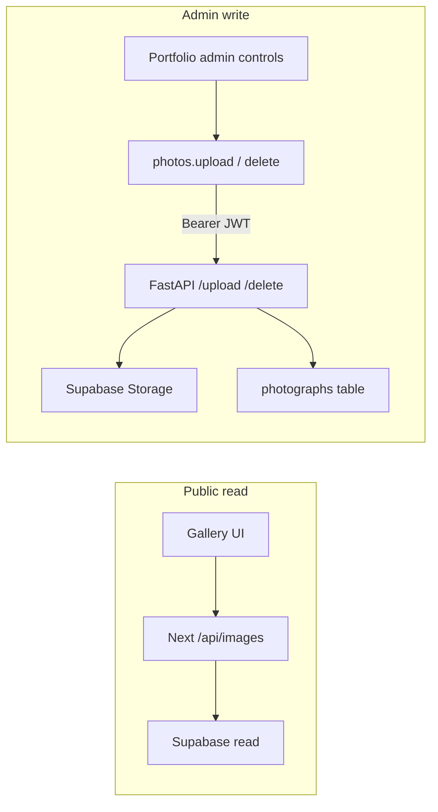

# Image upload pipeline

How photography reads, uploads, and deletes work on this portfolio.

## Goals

- **Reads are public** — anyone can browse the gallery; no auth required.
- **Upload and delete go through FastAPI** — the Next.js UI must not write to Supabase Storage or the `photographs` table directly. Mutations use the admin Supabase JWT against the Python API.



## Public browse (no login)

1. Gallery loads on the home page (`#creative-eye`).
2. `fetchPhotos` in `client/lib/photos.ts` calls Next.js **`GET /api/images`**.
3. That route (`client/app/api/images/route.ts`) reads from Supabase and returns `{ photos, total }`.
4. No FastAPI and no auth for this path.

## Admin upload

1. Sign in at `/admin` with GitHub (Supabase OAuth).
2. Only the configured GitHub username is treated as admin in the UI (`GITHUB_USERNAME` / backend `ADMIN_GITHUB_USERNAME`).
3. On the Portfolio section, pick JPEG files and a category, then submit.
4. Frontend loads the Supabase session `access_token`.
5. For each file it:
   - Rejects non-`.jpg` / `.jpeg`
   - Renames to `` `${Date.now()}_${filename}` `` (avoids FastAPI 409 on duplicate original names)
   - `POST {NEXT_PUBLIC_API_URL}/upload` with `FormData` (`file`, `category`) and header `Authorization: Bearer <token>`
6. FastAPI (`app/api/routes.py` → `PhotoStorageService`):
   - Verifies JWT and that GitHub `user_name` matches the admin username (or accepts deprecated `X-API-Key` for scripts)
   - Uploads bytes to Supabase Storage
   - Reads width/height with Pillow
   - Inserts a row in `photographs`
   - On DB failure, deletes the storage object
   - On duplicate filename → **409**
7. Frontend refreshes the gallery via `/api/images`.

## Admin delete

1. Admin enables delete mode and selects a photo.
2. Frontend `DELETE {NEXT_PUBLIC_API_URL}/delete/{id}` with the same Bearer JWT.
3. FastAPI deletes the DB row, then the storage object (storage failure after DB delete is logged as an orphan).
4. Gallery refreshes.

## What must be running

| Piece | Role |
|-------|------|
| Next frontend (`localhost:3000`) | Gallery UI + public `/api/images` |
| FastAPI (`localhost:8000`) | Authenticated upload/delete |
| Supabase | Storage bucket + `photographs` table |
| `NEXT_PUBLIC_API_URL` | Browser base URL for mutations (e.g. `http://localhost:8000`, no trailing slash) |

Public gallery reads use the Next/Supabase read env vars (`SUPABASE_*` / `NEXT_PUBLIC_SUPABASE_*` as documented in `client/.env.local.example`). Mutations need the FastAPI process configured with `DATABASE_URL`, `SUPABASE_*`, and admin auth settings (see root `.env.example`).

## Key files

| Concern | Location |
|---------|----------|
| Fetch / upload / delete client | `client/lib/photos.ts` |
| Gallery hook + progress | `client/lib/usePhotos.ts` |
| Admin upload UI | `client/components/sections/Portfolio.tsx` |
| Admin sign-in | `client/app/admin/page.tsx` |
| Public images API | `client/app/api/images/route.ts` |
| FastAPI routes | `app/api/routes.py` |
| Upload/delete service | `app/services/photo_operations.py` |
| Storage | `app/services/storage.py` |
| Admin auth | `app/auth/auth.py` |

## Auth surfaces

- **UI gate:** Portfolio shows upload/delete controls only when the signed-in GitHub username matches the site admin.
- **API enforcement:** FastAPI `verify_admin_key` requires a valid Supabase Bearer JWT for that admin (or `X-API-Key` for curl/scripts). The UI gate alone is not sufficient.

## Curl examples (scripts)

```bash
# Upload (API key)
curl -X POST http://localhost:8000/upload \
  -H "X-API-Key: $ADMIN_API_KEY" \
  -F "file=@photo.jpg" \
  -F "category=nature"

# Delete
curl -X DELETE http://localhost:8000/delete/123 \
  -H "X-API-Key: $ADMIN_API_KEY"
```

Prefer Bearer JWT from a real admin session when calling from the browser.

## Out of scope / follow-ups

- Locking down Supabase RLS so the anon key cannot write even if someone bypasses the UI.
- Batch upload endpoint on FastAPI (not present in current routes).
- Aligning older README paths that mention `/api/upload` prefixes with the live FastAPI mount (`/upload`, `/delete/{id}`, `/images`).
